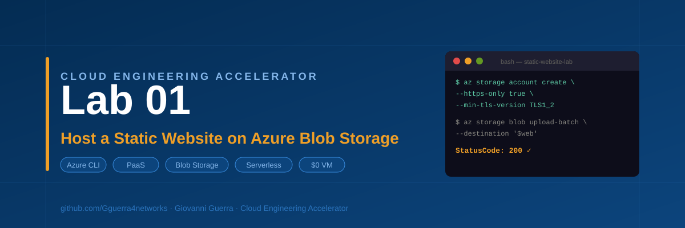

# Cloud Engineering Accelerator — Lab 01
# Host a Static Website on Azure Blob Storage



---

## What This Lab Is

You will deploy your first public-facing resource in Azure. Instead of building a complex server to host a simple website, you will use Azure Blob Storage. This introduces you to the concept of **PaaS (Platform as a Service)** and **Serverless hosting** — where you focus on the content and Azure handles the infrastructure.

No VM. No web server. No patching. Ever.

---

## What You Will Build

```
Your Laptop (VS Code)
      |
      | Azure CLI
      v
Azure Resource Group
      |
      v
Azure Storage Account
      |
      +-- $web container (public)
            |
            +-- index.html  →  https://yoursite.z13.web.core.windows.net
            +-- 404.html
```

---

## Skills You Will Practice

| Skill | Tool |
|---|---|
| Resource provisioning | Azure CLI |
| Static website hosting | Azure Blob Storage |
| HTTPS enforcement | Storage account security flags |
| TLS hardening | `--min-tls-version TLS1_2` |
| File upload and verification | Azure CLI + PowerShell |
| Status code verification | `Invoke-WebRequest` |
| Version control | Git |

---

## Cost

Under **$5 per month** for realistic personal traffic. Free for this lab if you delete the resource group when done.

---

## Time

**30 to 45 minutes** for a first run.

---

## Prerequisites

- Active Azure subscription
- Azure CLI installed — run `az version` to confirm
- VS Code with integrated terminal open
- Git installed

---

## Quick Start

```powershell
# Clone this repo
git clone https://github.com/Gguerra4networks/Azure-static-website-lab.git
cd Azure-static-website-lab

# Load your variables
. .\set-vars.ps1

# Sign in to Azure
az login --use-device-code

# Create the resource group
az group create --name $rg --location $location

# Create the storage account
az storage account create `
  --name $storage `
  --resource-group $rg `
  --location $location `
  --sku Standard_LRS `
  --kind StorageV2 `
  --https-only true `
  --min-tls-version TLS1_2

# Enable static website hosting
az storage blob service-properties update `
  --account-name $storage `
  --static-website `
  --index-document index.html `
  --404-document 404.html

# Upload your files
az storage blob upload-batch `
  --source . `
  --destination '$web' `
  --account-name $storage

# Get your live URL
az storage account show `
  --name $storage `
  --resource-group $rg `
  --query primaryEndpoints.web `
  --output tsv
```

---

## Security Flags Applied

```powershell
--https-only true          # Blocks all plain HTTP requests
--min-tls-version TLS1_2   # Refuses weak encryption connections
```

These are not on by default on older account types. Adding them at creation time means your site is secure from the first request.

---

## Verify the Site Is Live

```powershell
$endpoint = (az storage account show `
  --name $storage `
  --resource-group $rg `
  --query primaryEndpoints.web `
  --output tsv)

# Open in browser
Start-Process $endpoint

# Verify status code
Invoke-WebRequest -Uri $endpoint -UseBasicParsing | Select-Object StatusCode
```

You should see `StatusCode: 200`.

---

## Project Structure

```
Azure-static-website-lab/
├── index.html                        # Your main page
├── 404.html                          # Custom error page
├── set-vars.ps1                      # Lab variables — load this every session
├── README.md                         # This file
├── assets/
│   └── thumbnails/                   # LinkedIn post thumbnails
│       ├── banner.svg
│       ├── post1-loom.svg
│       ├── post2-github.svg
│       ├── post3-learned.svg
│       └── post4-different.svg
├── linkedin/
│   └── CEA-Lab01-LinkedIn-Posts.md   # All 4 posts ready to copy and paste
└── docs/
    └── CEA-Lab01-Static-Website-SOP.md  # Full step-by-step SOP
```

---

## Clean Up

```powershell
az group delete --name $rg --yes --no-wait
```

This removes every resource in the lab at once.

---

## LinkedIn Post Series

Four posts for this lab are in `/linkedin/CEA-Lab01-LinkedIn-Posts.md`

| Post | Topic |
|---|---|
| Post 1 | Loom video walkthrough |
| Post 2 | GitHub repository |
| Post 3 | One thing I learned |
| Post 4 | What I would do differently |

Thumbnails for each post are in `/assets/thumbnails/`

---

## Part of the Cloud Engineering Accelerator Series

| Lab | Topic |
|---|---|
| **Lab 01** | **Host a Static Website on Azure Blob Storage** |
| Lab 02 | Secure 2-Tier Web Application with Vulnerability Scanning |
| Lab 03 | Splunk SIEM on Azure |
| Lab 04 | ServiceNow ITSM |
| Lab 05 | Nessus Vulnerability Scanning |
| Lab 06 | Azure Active Directory with Terraform |

---

## Author

**Giovanni Guerra**
Cloud Engineer | DevOps & Infrastructure | Azure | Terraform | IaC | AD | Splunk

[GitHub](https://github.com/Gguerra4networks) · [LinkedIn](https://www.linkedin.com/in/giovanni-guerra)
