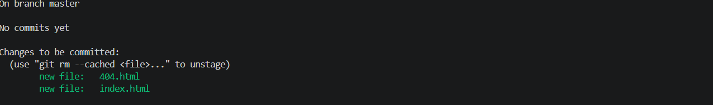
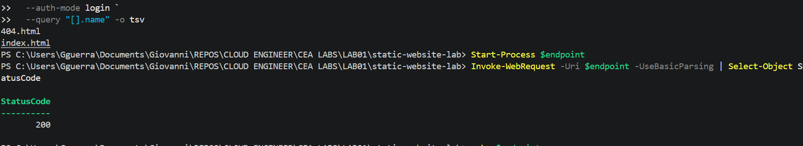

# Cloud Engineering Accelerator, Lab 01: Hosting Your First Static Website in Azure

🎬 Watch Me Build This Lab!

https://www.loom.com/share/REPLACE_WITH_YOUR_LOOM_LINK

A hands-on Azure lab that deploys a real, public, HTTPS-secured website using nothing but Azure Blob Storage, no virtual machine, no web server software, no patching ever required. Built entirely with the Azure CLI inside VS Code, fully scriptable and repeatable, not a portal click-through.

## Live site

https://stlab01giovanni47.z13.web.core.windows.net/

## What this lab demonstrates

- Serverless, PaaS-style hosting: Azure runs the infrastructure, you only manage the content
- Every step converted from a portal walkthrough into real, scriptable Azure CLI commands
- Storage account security done right from the start: HTTPS-only transfer, TLS 1.2 minimum, and public access scoped to exactly one container
- Azure AD identity-based uploads instead of a shared storage account key
- A real, tested cost breakdown instead of a guess
- A real troubleshooting log, not a hypothetical one. Every problem below actually happened while building this lab

## Proof it works

 
The live site, loaded directly from the public endpoint.

 
index.html and 404.html staged for the first commit, straight from the terminal.

 
Blob list confirming both files uploaded, followed by a direct request to the live endpoint returning a real 200 status.

## Architecture

| Piece | Role |
|---|---|
| **Visitor's browser** | Sends a normal HTTPS request, no special client needed |
| **Storage account** | Holds the site's files, HTTPS-only and TLS 1.2 minimum enforced |
| **$web container** | The one specific container Azure serves publicly, everything else in the account stays private |
| **index.html** | Returned directly to the visitor, no server in between |

## Security

| Setting | Why it matters |
|---|---|
| HTTPS only | Blocks any plain HTTP request to the storage account's data APIs |
| Minimum TLS 1.2 | Refuses older, weaker encryption |
| Only $web is public | Enabling static website hosting exposes exactly one container, nothing else in the account |
| Uploads use Azure AD identity, not the account key | Losing a storage account key means losing full read and write access to everything in the account. This lab never writes that key to a file |
| Blob soft delete enabled | Recoverable for 7 days if a file is accidentally overwritten or deleted |

## Cost to run this full time

Real numbers, not a guess. Static website hosting on Blob Storage bills on three things: how much you store, how many read and write operations happen, and how much data leaves Azure to reach visitors, called egress.

| Traffic level | Estimated monthly visits | Estimated monthly cost |
|---|---|---|
| Personal portfolio, light traffic | Under 1,000 | Under $0.50 |
| Moderate traffic, shared on LinkedIn or a resume | 1,000 to 20,000 | $0.50 to $2 |
| Higher traffic, actively promoted site | 20,000 to 100,000 | $2 to $10 |

Adding a custom domain through Azure CDN adds a few dollars a month for caching and a custom certificate. Azure Front Door with a Web Application Firewall adds roughly $35 a month as a base fee, likely overkill for a personal portfolio site. Full breakdown, including per-operation pricing, is in the SOP document in this repo.

## Acronyms used in this lab

| Term | Meaning |
|---|---|
| PaaS | Platform as a Service, Azure manages the infrastructure, you manage the content |
| LRS | Locally Redundant Storage, data copied three times within a single datacenter |
| TLS | Transport Layer Security, the encryption behind HTTPS |
| CDN | Content Delivery Network, caches content closer to visitors around the world |
| WAF | Web Application Firewall |
| RBAC | Role-Based Access Control, used here to grant upload permission without sharing the account key |
| Egress | Data leaving Azure's network, the main real cost driver for a site like this |

## Running this lab

Full step-by-step SOP, written so a 12 year old could follow it, every command tested for real, see `CEA_Lab01_Static_Website_SOP.docx` or `.pdf` in this repo.

### Build steps (summary)

1. Confirm starting folder and prerequisites
2. Create the resource group and storage account, with HTTPS-only, TLS 1.2 minimum, and public blob access explicitly enabled
3. Enable static website hosting and capture the live endpoint
4. Create index.html and 404.html directly in VS Code
5. Grant your own identity upload permission on the storage account
6. Upload both files using that identity, not the account key
7. Validate the live site returns a real 200 response
8. Tear down with a single resource group delete when finished

## Lessons learned

- Azure's newer storage accounts default `allowBlobPublicAccess` to false. Static website hosting silently fails to actually display for visitors unless this is explicitly set to true at creation. This is now baked into the SOP's create command instead of being a surprise.
- The container static website hosting relies on is literally named `$web`. In PowerShell, that name inside double quotes gets treated as a variable substitution and silently breaks. Every command in this lab wraps it in single quotes specifically to prevent that.
- `az role assignment create --assignee youremail@example.com` can fail with a Graph lookup error even for a completely valid account. Using `--assignee-object-id` with the account's actual Object ID, retrieved with `az ad signed-in-user show`, sidesteps the problem entirely.
- RBAC role assignments are not instant. A role can be created successfully and still not work for a minute or two afterward. This isn't a broken command, it's real backend propagation delay.

---

Part of the Cloud Engineering Accelerator series.
